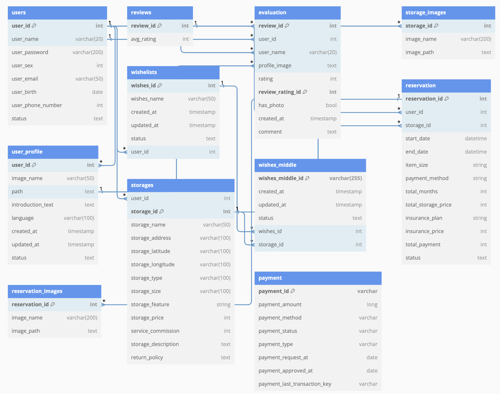
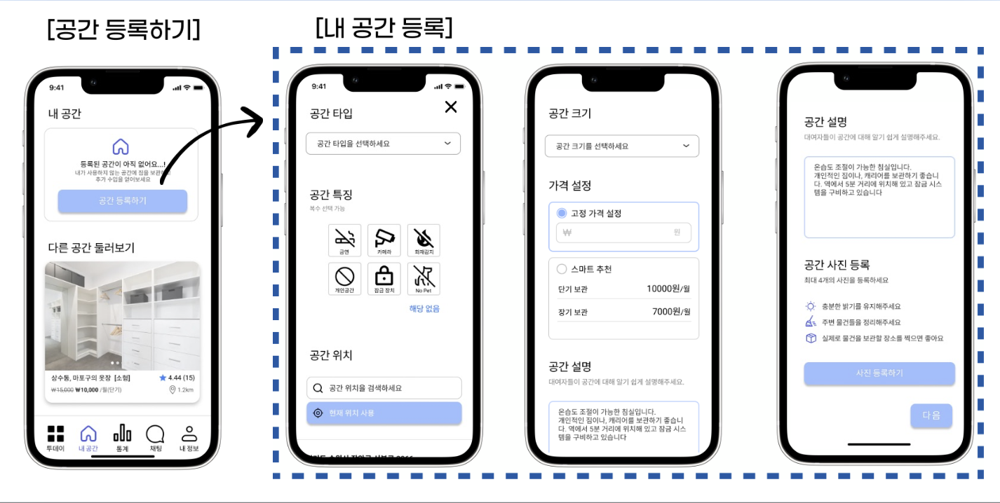
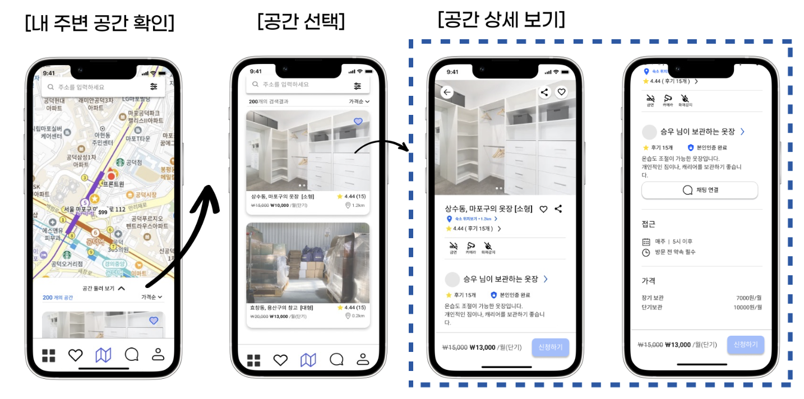
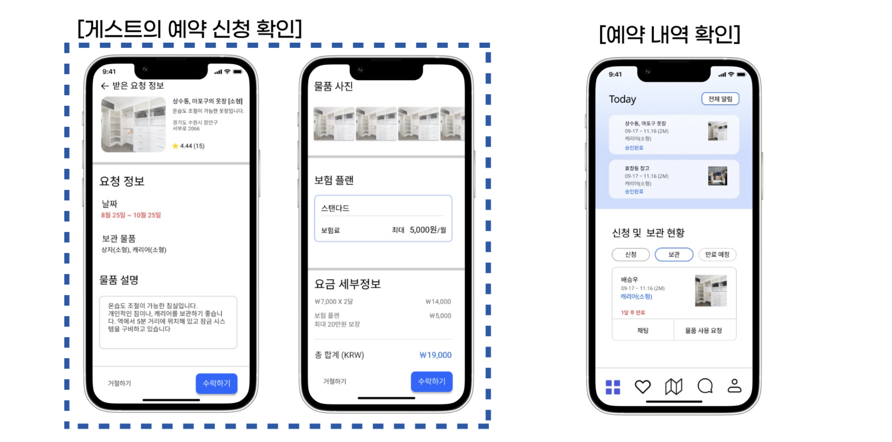
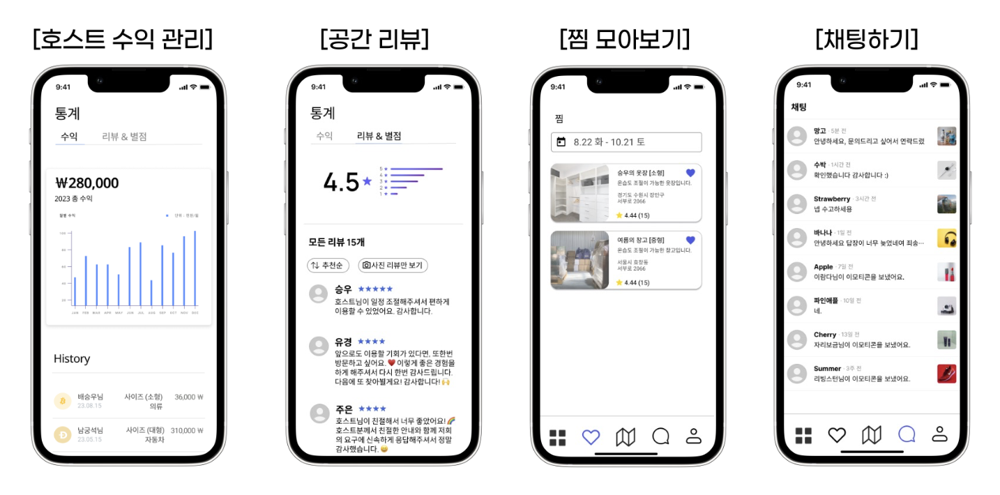

# 꽃처럼 찬란하게 피어라, 피어락

## 프로젝트 소개

####  개발 기간

-   2023.08.07 ~ 2023.08.20 (2주)

<br>

#### 기획 배경

1인 가구의 증가, 주거 면적의 감소로 인해 공간 부족 문제가 발생하고 있는 추세입니다. 이러한 도심 공간 부족 문제를 경제적으로 해결할 수 있는 방법에 대해 고민했습니다. 문제 해결 방법으로 도심 속 잉여 공간을 찾고 저렴하게 거래할 수 있도록 개인과 개인을 연결해주자는 아이디어를 도출하여 기획하게 되었습니다.

<br>

#### 서비스 소개

짐을 보관하고 싶은 유저와 공간을 대여해주고자 하는 호스트를 연결해주는 개인과 개인 간 공간 대여 연결 서비스입니다.

A P2P service alternative to traaditional storage facilities.

<br>

#### 기술 스택

<div align=left>
  <table>
    <tr>
        <td><b>Back-end</td>
        <td>
          
          
          
          
          
        </td>
    </tr>
    <tr> 
      <td><b>Front-end</td>
      <td>
       
      
      
       
       
       
  <br>
  </td>
<tr>
<td><b>Tools</td>
  <td>
  
	
  </td>
 <tr>
<td><b>UI/UX</td>
  <td>
    
    <br>
  </td>
</table>
</div>

<br>

### 프로젝트 구성
#### ERD


<br>

## 프로젝트 구조

### Frontend (React)

```
client
├─ .eslintrc
├─ .gitignore
├─ .prettierrc
├─ README.md
├─ package-lock.json
├─ package.json
├─ public
│  ├─ favicon.ico
│  ├─ google1.png
│  ├─ grahamroberts.jpeg
│  ├─ index.html
│  ├─ kakao.png
│  ├─ logo192.png
│  ├─ logo512.png
│  ├─ manifest.json
│  ├─ mockServiceWorker.js
│  ├─ naver.png
│  └─ robots.txt
└─ src
   ├─ App.js
   ├─ App.test.js
   ├─ GlobalStyles.js
   ├─ Review
   │  └─ Review.js
   ├─ api
   │  ├─ changeView.js
   │  ├─ getMyStorage.js
   │  ├─ getReservationDetails.js
   │  ├─ getStorageDetail.js
   │  ├─ getStorageList.js
   │  ├─ getWishList.js
   │  ├─ index.js
   │  ├─ login.js
   │  └─ registStorage.js
   ├─ components
   │  ├─ AddressInput.jsx
   │  ├─ FixBottomNavigation.jsx
   │  ├─ FixBottomNavigationHost.jsx
   │  ├─ NaverMapComponent.jsx
   │  ├─ chat
   │  │  └─ ChatList.jsx
   │  ├─ common
   │  │  ├─ AppHeader.jsx
   │  │  ├─ SearchComponent.jsx
   │  │  ├─ SelectComponent.jsx
   │  │  └─ TopNavigationComponent.jsx
   │  ├─ my
   │  │  ├─ AddStorageCard.jsx
   │  │  └─ MyStorageComponent.jsx
   │  ├─ storage
   │  │  ├─ StorageDetail.jsx
   │  │  ├─ StorageList.jsx
   │  │  ├─ StorageReservationUploadComponent.jsx
   │  │  └─ StoreagReservationComponent.jsx
   │  └─ wish
   │     └─ WishList.jsx
   ├─ constants
   │  ├─ colors.js
   │  └─ commonStyle.js
   ├─ index.css
   ├─ index.js
   ├─ logo.svg
   ├─ mocks
   │  ├─ browser.js
   │  ├─ handlers
   │  │  ├─ chat.js
   │  │  ├─ storage.js
   │  │  └─ user.js
   │  ├─ index.js
   │  └─ server.js
   ├─ pages
   │  ├─ Chat
   │  │  ├─ Chat.jsx
   │  │  └─ ChatHost.jsx
   │  ├─ Finance
   │  │  └─ FinanceHost.jsx
   │  ├─ Home
   │  │  ├─ HomeGuest.jsx
   │  │  ├─ HomeHost.jsx
   │  │  └─ Login.jsx
   │  ├─ Map
   │  │  └─ MapScreen.jsx
   │  ├─ My
   │  │  ├─ MyGuest.jsx
   │  │  ├─ MyHost.jsx
   │  │  └─ MyStoragePage.jsx
   │  ├─ Review
   │  │  └─ Review.jsx
   │  ├─ Routes.js
   │  ├─ Storage
   │  │  ├─ Storage.jsx
   │  │  ├─ StorageDetailPage.jsx
   │  │  ├─ StorageRegist.jsx
   │  │  ├─ StorageReservationUploadPage.jsx
   │  │  └─ StoreagReservationPage.jsx
   │  └─ Wish
   │     └─ Wish.jsx
   ├─ reportWebVitals.js
   ├─ setupTests.js
   └─ styles
      ├─ app.scss
      ├─ colors.scss
      ├─ font.scss
      └─ fonts
         ├─ NanumGothic.eot
         ├─ NanumGothic.woff
         ├─ NanumGothicExtraBold.eot
         ├─ NanumGothicExtraBold.woff
         ├─ SpoqaHanSansNeo-Bold.ttf
         ├─ SpoqaHanSansNeo-Light.ttf
         ├─ SpoqaHanSansNeo-Medium.ttf
         └─ SpoqaHanSansNeo-Regular.ttf

```

### Backend (Spring Boot)

```
Server
├─ .gitignore
├─ gradle
│  └─ wrapper
│     ├─ gradle-wrapper.jar
│     └─ gradle-wrapper.properties
├─ gradlew
├─ gradlew.bat
└─ src
   ├─ main
   │  ├─ java
   │  │  └─ com
   │  │     └─ fintech
   │  │        └─ Server
   │  │           ├─ ServerApplication.java
   │  │           ├─ api
   │  │           │  ├─ controller
   │  │           │  │  ├─ ReservationController.java
   │  │           │  │  ├─ StorageController.java
   │  │           │  │  └─ UserController.java
   │  │           │  ├─ dto
   │  │           │  │  ├─ ReservationCreateRequestDto.java
   │  │           │  │  ├─ ReservationImageResponseDto.java
   │  │           │  │  ├─ ReservationListResponseDto.java
   │  │           │  │  ├─ StorageImageResponseDto.java
   │  │           │  │  ├─ StorageListResponseDto.java
   │  │           │  │  ├─ StorageRegisterRequestDto.java
   │  │           │  │  ├─ UserDeleteResponseDto.java
   │  │           │  │  ├─ UserInfoResponseDto.java
   │  │           │  │  ├─ UserLoginRequestDto.java
   │  │           │  │  ├─ UserRegistrationDto.java
   │  │           │  │  └─ UserResponseDto.java
   │  │           │  ├─ entity
   │  │           │  │  ├─ BaseEntity.java
   │  │           │  │  ├─ ReservationEntity.java
   │  │           │  │  ├─ ReservationImageEntity.java
   │  │           │  │  ├─ ReservationStatus.java
   │  │           │  │  ├─ StorageEntity.java
   │  │           │  │  ├─ StorageImageEntity.java
   │  │           │  │  ├─ StorageStatus.java
   │  │           │  │  └─ user
   │  │           │  │     ├─ UserEntity.java
   │  │           │  │     ├─ UserProfileEntity.java
   │  │           │  │     ├─ UserStatus.java
   │  │           │  │     └─ kakao
   │  │           │  ├─ exception
   │  │           │  ├─ repository
   │  │           │  │  ├─ ReservationImageRepository.java
   │  │           │  │  ├─ ReservationRepository.java
   │  │           │  │  ├─ StorageImageRepository.java
   │  │           │  │  ├─ StorageRepository.java
   │  │           │  │  └─ UserRepository.java
   │  │           │  ├─ reservation.json
   │  │           │  ├─ service
   │  │           │  │  ├─ ImageUploadService.java
   │  │           │  │  ├─ ReservationService.java
   │  │           │  │  ├─ ReservationServiceImpl.java
   │  │           │  │  ├─ StorageService.java
   │  │           │  │  ├─ StorageServiceImpl.java
   │  │           │  │  ├─ UserService.java
   │  │           │  │  └─ UserServiceImpl.java
   │  │           │  ├─ storage.json
   │  │           │  └─ user.json
   │  │           ├─ config
   │  │           │  ├─ ClientConfig.java
   │  │           │  ├─ SwaggerConfig.java
   │  │           │  └─ WebConfig.java
   │  │           └─ util
   │  └─ resources
   │     ├─ application-dev.yml
   │     ├─ application-local.yml
   │     ├─ application.yml
   │     ├─ logback-spring.xml
   │     ├─ static
   │     └─ templates
   └─ test
      └─ java
         └─ com
            └─ fintech
               └─ Server
                  └─ ServerApplicationTests.java

```


## 와이어프레임









<br>

## 협업 환경

### Git
Git을 통한 협업 방식은 커밋 컨벤션을 기반으로 Git Flow를 진행했습니다. 
- master: 서비스가 출시될 수 있는 브랜치로, master 브랜치에 올라온 기능들은 에러 없이 작동하는 상태입니다.
- develop: 다음 서비스 출시를 위해 실제 개발이 이루어지는 브랜치입니다.
- 기능 단위 branch: 기능 단위 개발을 위한 브랜치로, develop에서 분기하여 개발이 끝나면 develop 브랜치로 병합됩니다.

### Notion
회의록, 스크럼 회의, 발표 정리, 문서 정리, 기획서 등 자료들을 Notion을 통해 작성 및 관리하였습니다.

- `회의록`: 매일 회의한 내용을 회의록으로 기록하였습니다.
- `컨벤션`: 프로젝트의 모든 컨벤션들을 문서화하여 모두가 공유 가능하도록 하였습니다. 기록 및 정리한 컨벤션들에는 Git 컨벤션, FE 컨벤션, BE 컨벤션이 있습니다.
- `프로젝트 문서 관리`: 요구사항 정의서, 기능명세서, 일정관리 등 공유 문서 관리를 노션에 기록하여 모두가 동일한 목표를 가지고 개발 할 수 있도록 하였습니다.

<br>

## 팀원
### 피어락 팀 소개
<table>
<thead>
<tr>
<th>양종욱/팀장</th>
<th>윤주혜/팀원</th>
<th>김가연/팀원</th>
<th>이원준/팀원</th>
<th>배승우/팀원</th>
<th>차규빈/팀원</th>
</tr>
</thead>
</table>

<br>

